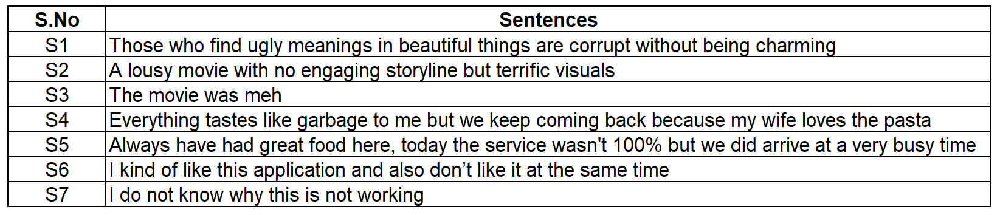
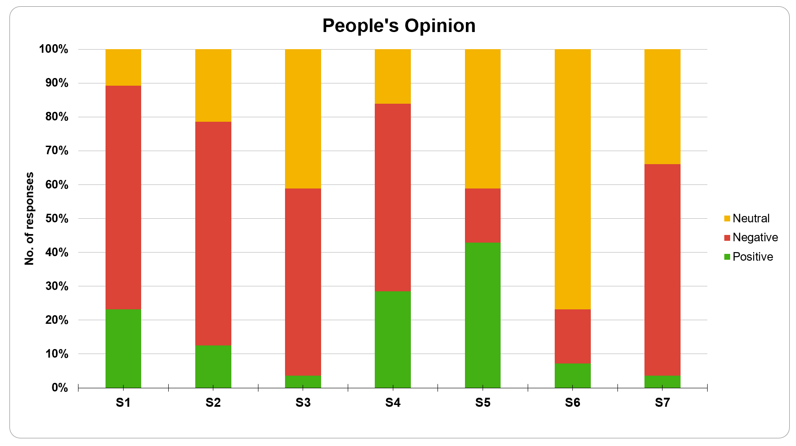
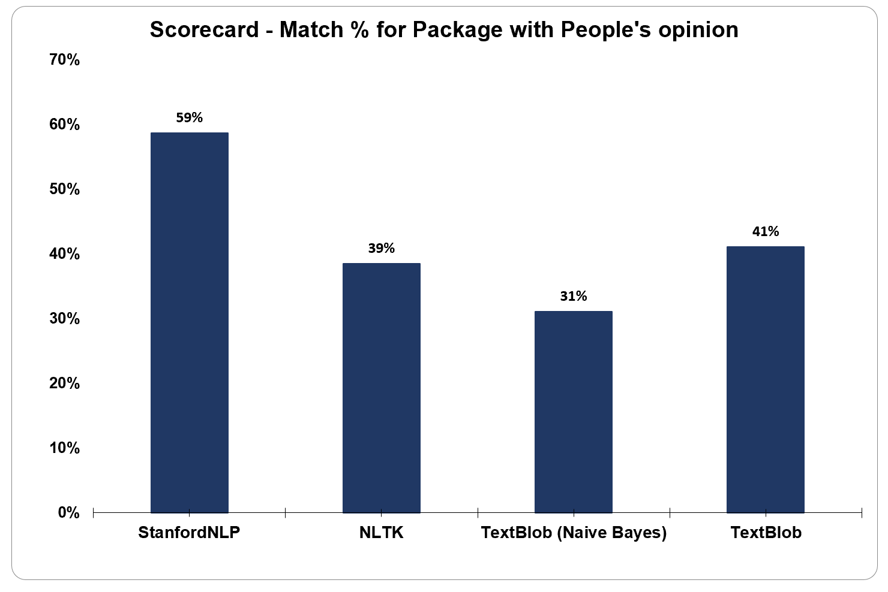

## Sentiment Analysis using StanfordCoreNLP vs TextBlob vs NLTK

A short experiment to analyze the sentiment analysis capabilities of python libraries - StanfordCoreNLP, TextBlob and NLTK, done as part of an academic event at University of Minnesota - MSBA 2020 Trends Marketplace. 

#### Experiment setup and Results

This experiment considered basic off-the-shelf modules from the mentioned three libraries for comparison. After pre-processing seven ambiguous English sentences, the modules were used to determine the sentiment category of each sentence - whether it is Positive, Negative or Neutral. The sentiments determined by the modules were later compared to responses from event visitors to observe the similarity/differences in the results. 

People's opinion of sentiment of the seven sentences varied much (*as seen in Fig.1 below*) , pointing the ambiguity of the sentences chosen

​                                                            *Figure 1 - People's opinion on sentiments* 

Given this complexity in Natural Language Processing in terms of ambiguity, we observed the results from StanfordCoreNLP module having the highest match percent of 59% with people's responses followed by TextBlob with 41% match. 

**This indicates better performance from StanfordCoreNLP module with closest match to people's opinion being the favorable outcome.**

​                          *Figure 2 - Match % for sentiment results from each package with people's opinions* 

#### Limitation

The comparison was made between basic off-the-shelf modules with default pre-training done from each of the libraries. The performance would vary based on the following conditions:

* Different pre-processing of input sentences
* Using a different training / pre-trained dictionary for the sentiment classification

#### Contributors

[Aadarsh Gupta](https://www.linkedin.com/in/darsh20/) - gupta528@umn.edu

[Anirudh Srikant](https://www.linkedin.com/in/anirudh-srikant/) - srika028@umn.edu

[Arnav Sivaram](https://www.linkedin.com/in/arnav-sivaram/) - sivar031@umn.edu

[Karthik Ravishankar](https://www.linkedin.com/in/karthikrc1/) - ravis038@umn.edu

[Mainak Roy](https://www.linkedin.com/in/mainak-roy/)  - roy00083@umn.edu

[Sameeksha Aithal](https://www.linkedin.com/in/sameeksha-aithal/) - aitha010@umn.edu